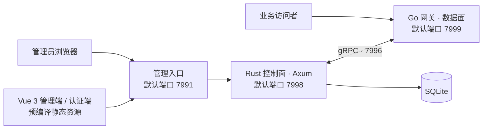

<p align="center">
  <a href="https://www.fnknock.cn/">
    
  </a>
</p>

<h1 align="center">fn-knock · 敲门</h1>

<p align="center">
  <strong>简体中文</strong> ·
  <a href="./docs/readme/README.en.md">English</a> ·
  <a href="./docs/readme/README.ko.md">한국어</a> ·
  <a href="./docs/readme/README.ja.md">日本語</a>
</p>

<p align="center">
  面向 NAS、软路由与家庭服务器的多平台高性能安全网关
</p>

<p align="center">
  <a href="https://www.fnknock.cn/"></a>
  
  
  
  <a href="https://hub.docker.com/r/kcilnk/fn-knock"></a>
  <a href="./LICENSE"></a>
</p>

<p align="center">
  <a href="https://www.fnknock.cn/">官网</a> ·
  <a href="https://docs.fnknock.cn/">使用文档</a> ·
  <a href="https://www.fnknock.cn/">下载安装</a> ·
  <a href="https://www.fnknock.cn/legal#terms">用户协议</a> ·
  <a href="https://www.fnknock.cn/legal#privacy">隐私政策</a>
</p>

fn-knock 已完成原生化重构，正式运行时采用 **Rust 控制面 + Go 数据面**，内置 SQLite 存储，**不依赖 Node.js，也不需要 Redis**。Node.js 仅用于从源码开发 Vue 前端和编排仓库构建任务。

## 为什么选择 fn-knock

fn-knock 把反向代理、登录鉴权、证书、DDNS、访问控制、WAF、隧道和运行状态集中到一个管理面板中，帮助你更安全、更轻松地把私有服务开放给可信访问者。

| 能力       | 说明                                                      |
| ---------- | --------------------------------------------------------- |
| 安全网关   | 反向代理、认证前置、访问日志、Host / Path / TCP 映射      |
| 身份认证   | 密码、TOTP、Passkey、OIDC、验证码与精细化认证规则         |
| 域名与证书 | ACME 证书申请、SSL 配置、多服务商 DDNS                    |
| 主动防护   | IP 白名单、地区可见性、WAF、爬虫拦截、登录退避与限流      |
| 内网穿透   | Cloudflared、frpc 的配置、启停、日志与状态管理            |
| 日常运维   | 系统监控、事件审计、在线终端、通知、备份与更新检查        |
| 多平台交付 | fnOS、OpenWrt、Docker、Windows、Synology DSM 与通用 Linux |

## 架构



- **Rust 控制面**：管理 API、认证、安全策略、证书、DDNS、隧道与系统运维。
- **Go 数据面**：处理网关监听、反向代理与高并发业务流量。
- **Vue 3 前端**：构建后作为静态资源随安装包或镜像发布，不需要 Node.js 运行时。
- **SQLite 存储**：新部署无需额外维护 Redis 服务。

## 下载与安装

请优先前往 [fn-knock 官网](https://www.fnknock.cn/) 选择设备平台和架构。官网会提供与当前系统匹配的安装包、安装命令及最新使用说明。

| 平台          | 系统 / 架构              | 下载或安装                                                                                                                                                              |
| ------------- | ------------------------ | ----------------------------------------------------------------------------------------------------------------------------------------------------------------------- |
| 飞牛 fnOS     | x86_64                   | [下载 FPK](https://get.fnknock.cn/)                                                                                                                                     |
| 飞牛 fnOS     | ARM64 / aarch64          | [下载 FPK](https://get.fnknock.cn/?arch=arm64)                                                                                                                          |
| OpenWrt       | x86_64                   | [APK（25.12+）](https://get.fnknock.cn/?type=apk&arch=x86_64) · [IPK（24.10 / 旧版）](https://get.fnknock.cn/?type=ipk&arch=x86_64)                                     |
| OpenWrt       | aarch64_cortex-a53       | [APK（25.12+）](https://get.fnknock.cn/?type=apk&arch=aarch64_cortex-a53) · [IPK（24.10 / 旧版）](https://get.fnknock.cn/?type=ipk&arch=aarch64_cortex-a53)             |
| OpenWrt       | aarch64_generic          | [APK（25.12+）](https://get.fnknock.cn/?type=apk&arch=aarch64_generic) · [IPK（24.10 / 旧版）](https://get.fnknock.cn/?type=ipk&arch=aarch64_generic)                   |
| OpenWrt       | arm_cortex-a7_neon-vfpv4 | [APK（25.12+）](https://get.fnknock.cn/?type=apk&arch=arm_cortex-a7_neon-vfpv4) · [IPK（24.10 / 旧版）](https://get.fnknock.cn/?type=ipk&arch=arm_cortex-a7_neon-vfpv4) |
| OpenWrt       | arm_cortex-a5_vfpv4      | [APK（25.12+）](https://get.fnknock.cn/?type=apk&arch=arm_cortex-a5_vfpv4) · [IPK（24.10 / 旧版）](https://get.fnknock.cn/?type=ipk&arch=arm_cortex-a5_vfpv4)           |
| Docker        | amd64 / arm64 / armv7    | [Docker Hub](https://hub.docker.com/r/kcilnk/fn-knock) · [部署说明](./deploy/docker/README.md)                                                                          |
| Windows       | Windows x86_64           | [下载 EXE](https://get.fnknock.cn/?type=windows&arch=x86_64) · [安装说明](https://www.fnknock.cn/windows)                                                               |
| 群晖 Synology | DSM 7.0+ x86_64          | [下载 SPK](https://get.fnknock.cn/?type=synology&arch=x86_64) · [安装说明](https://www.fnknock.cn/synology)                                                             |
| Linux         | x86_64 / ARM64 / ARMv7   | [一键安装](https://www.fnknock.cn/linux) · [部署文档](https://docs.fnknock.cn/quick-start/linux-deployment)                                                             |

### Docker

```bash
docker pull kcilnk/fn-knock:latest
```

生产环境请按 [Docker Compose 部署说明](./deploy/docker/README.md) 配置端口、数据卷、IPv6 子网和可信代理。

### Linux

支持 systemd 和 Alpine Linux 使用的 OpenRC。官方一键安装命令：

```bash
wget -qO- https://cdn.fnknock.cn/install.sh | { if [ "$(id -u)" -eq 0 ]; then sh; else sudo sh; fi; }
```

安装完成后打开 `http://<设备 IP>:7991` 设置管理密码。网关业务入口默认为 `7999`。

> [!WARNING]
> 不要把 `7991` 管理端口直接暴露到公网。远程管理请使用 VPN，或配置带 HTTPS 与访问控制的可信反向代理。

## 默认端口

| 端口   | 组件        | 默认用途                    |
| ------ | ----------- | --------------------------- |
| `7991` | 管理入口    | 浏览器访问管理面板          |
| `7999` | Go 网关     | 对外承载代理业务流量        |
| `7998` | Rust 后端   | 内部管理 API                |
| `7997` | 认证服务    | 内部认证页面服务            |
| `7996` | Go 管理接口 | Rust 与 Go 之间的 gRPC 通信 |

具体监听范围会因平台而异，请以对应平台的安装说明为准。

## 供应链与隐私

每次正式发布都会生成可核验的发布元数据：

- Docker 多架构镜像发布 **SBOM** 与最大级别的构建来源信息（provenance）。
- GitHub Release 中的安装包会附带构建来源证明，并提供完整产物清单与 SHA-256。
- [release-manifest.json](https://github.com/kci-lnk/fn-knock-turborepo/releases/latest/download/release-manifest.json) 记录版本、源码提交、Go 网关提交、平台、架构、文件大小与摘要。
- [SHA256SUMS](https://github.com/kci-lnk/fn-knock-turborepo/releases/latest/download/SHA256SUMS) 可用于校验 Release 中的下载文件。

安装或使用前，请阅读：

- [用户协议](https://www.fnknock.cn/legal#terms)
- [隐私政策](https://www.fnknock.cn/legal#privacy)
- [第三方开源软件说明](https://www.fnknock.cn/third-party-software)

fn-knock 以自托管为核心。官方隐私政策会区分官网及官方在线服务处理的数据，与部署在你自己设备上的账号、日志、会话和代理业务数据；如果你向他人开放自己的实例，仍应根据实际配置提供独立的隐私告知。

## 从源码开发

### 开发环境

| 工具                              | 用途                                                    |
| --------------------------------- | ------------------------------------------------------- |
| Rust `1.96.0`                     | Rust 控制面与 Windows 原生管理程序                      |
| Go                                | 构建 `Go-Reauth-Proxy` 网关，版本要求以其 `go.mod` 为准 |
| Node.js `^20.19.0` 或 `>=22.12.0` | 仅用于 Vue 前端构建、测试和 Turborepo 任务编排          |
| npm `10.8.2`                      | Workspace 包管理                                        |
| Docker / Buildx                   | 多架构镜像及部分跨平台产物构建                          |

```bash
npm ci
npm run dev
```

质量检查：

```bash
npm run lint
npm run check-types
npm run test
npm run security:audit
```

构建全部工作区：

```bash
npm run build
```

Go 网关源码默认从相邻目录 `../Go-Reauth-Proxy` 读取，也可以通过 `FN_KNOCK_GO_REAUTH_PROXY_DIR` 指定路径。

## 仓库结构

| 路径                      | 说明                                       |
| ------------------------- | ------------------------------------------ |
| `apps/server-admin-rs`    | Rust / Axum 管理后端、认证与控制面         |
| `apps/server-admin-view`  | Vue 3 管理后台                             |
| `apps/server-auth-view`   | Vue 3 认证页面                             |
| `apps/fn-knock-desktop`   | Rust + Win32 Windows 管理程序与 NSIS 配置  |
| `apps/fn-knock`           | 飞牛 fnOS 原生 FPK 适配                    |
| `apps/fn-knock-docker`    | 飞牛 fnOS Docker FPK 适配                  |
| `apps/fn-knock-synology`  | Synology DSM 7 原生 SPK 适配               |
| `deploy/docker`           | Dockerfile、Compose 与镜像发布配置         |
| `deploy/linux`            | systemd / OpenRC 通用 Linux 安装与管理脚本 |
| `deploy/openwrt`          | OpenWrt APK / IPK 与 LuCI 适配             |
| `packages/grpc-contracts` | Rust 控制面与 Go 网关的 gRPC 协议          |
| `packages/*`              | 前端共享组件、API、国际化与工程配置        |

## 常用构建命令

| 命令                                           | 用途                                     |
| ---------------------------------------------- | ---------------------------------------- |
| `npm run fn-knock:build-package`               | 构建 fnOS FPK                            |
| `npm run fn-knock:linux:prepare`               | 构建通用 Linux 产物                      |
| `npm run fn-knock:openwrt:build`               | 构建 OpenWrt APK 与 IPK                  |
| `npm run fn-knock:spk:build`                   | 构建 Synology SPK                        |
| `npm run fn-knock:docker:build`                | 构建本地 Docker 镜像                     |
| `npm run fn-knock:windows:test`                | 运行 Windows 原生构建检查                |
| `npm run fn-knock:windows:build`               | 构建 Windows x86_64 unsigned NSIS 安装包 |
| `npm run fn-knock:release:test`                | 检查完整发布链路                         |
| `npm run fn-knock:release:preflight -- vX.Y.Z` | 校验版本与发布前置条件                   |

推送与 `version.json` 一致的 `vX.Y.Z` tag 后，发布工作流会冻结当前源码和 Go 网关提交，完成质量门禁、多平台构建、架构校验、校验清单、SBOM / provenance 及 GitHub Release 发布。

## 支持项目

如果 fn-knock 对你有帮助，可以请作者喝杯咖啡，支持项目继续维护。

<p align="center">
  
</p>

## License

[MIT](./LICENSE)
