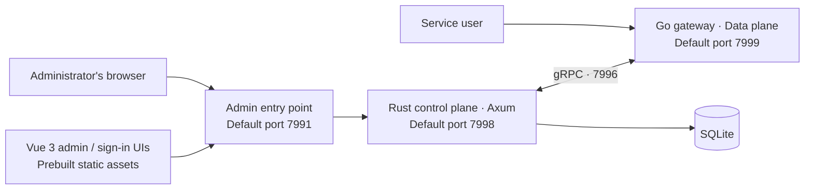

<p align="center">
  <a href="https://www.fnknock.cn/">
    
  </a>
</p>

<h1 align="center">fn-knock</h1>

<p align="center">
  <a href="../../README.md">简体中文</a> ·
  <strong>English</strong> ·
  <a href="./README.ko.md">한국어</a> ·
  <a href="./README.ja.md">日本語</a>
</p>

<p align="center">
  A high-performance, cross-platform security gateway for NAS appliances, OpenWrt routers, and home servers
</p>

<p align="center">
  <a href="https://www.fnknock.cn/"></a>
  
  
  
  <a href="https://hub.docker.com/r/kcilnk/fn-knock"></a>
  <a href="../../LICENSE"></a>
</p>

<p align="center">
  <a href="https://www.fnknock.cn/">Website</a> ·
  <a href="https://docs.fnknock.cn/">Documentation</a> ·
  <a href="https://www.fnknock.cn/">Downloads</a> ·
  <a href="https://www.fnknock.cn/legal#terms">Terms of Service</a> ·
  <a href="https://www.fnknock.cn/legal#privacy">Privacy Policy</a>
</p>

fn-knock has been rebuilt as a native application. Its production runtime combines a **Rust control plane with a Go data plane** and uses built-in SQLite storage. **Neither Node.js nor Redis is required at runtime.** Node.js is only used to develop the Vue frontends and orchestrate monorepo builds from source.

## Why fn-knock?

fn-knock brings reverse proxying, access authentication, TLS certificates, DDNS, access control, WAF, outbound tunnels, and service health into a single dashboard. It gives you a safer and simpler way to expose self-hosted services to trusted users.

| Feature                 | What it provides                                                                                                                |
| ----------------------- | ------------------------------------------------------------------------------------------------------------------------------- |
| Secure gateway          | Reverse proxy, forward authentication, access logs, Host / path routing, and TCP proxying                                       |
| Authentication          | Passwords, TOTP, passkeys, OIDC, LDAP/Active Directory, verification challenges, and granular authentication policies           |
| Domains and TLS         | ACME certificate issuance, TLS configuration, and multi-provider DDNS                                                           |
| Proactive protection    | IP allowlists, geo-based access policies, WAF, bot blocking, login backoff, and rate limiting                                   |
| Outbound tunnels        | Configuration, lifecycle control, logs, and health monitoring for Cloudflare Tunnel (`cloudflared`) and the frp client (`frpc`) |
| Day-to-day operations   | System monitoring, audit events, web terminal, notifications, backups, and update checks                                        |
| Multi-platform packages | fnOS, OpenWrt, Docker, Windows, macOS, Synology DSM, and general-purpose Linux                                                  |

The Web Terminal continues to support SSH targets whose host fingerprints an administrator explicitly trusts. Full FPK, general-purpose Linux, macOS, and OpenWrt packages can also enable a local PTY. Local access is disabled by default and always inherits the effective UID/GID of the fn-knock service, including root privileges when the service runs as root. FPK Lite, Synology, Docker, Windows, and development deployments do not expose a local terminal.

> [!WARNING]
> Verify the displayed service identity, shell, and initial directory before enabling local access. The local terminal does not drop privileges, switch users, or connect through localhost SSH. Closing the browser leaves the in-process session running, while restarting fn-knock ends it. On full FPK, terminal traffic is forwarded only by `index.cgi` to the loopback Rust service; it must never use the fnOS unified gateway, Go/gRPC routes, or WebSocket.

## Architecture



- **Rust control plane:** Management APIs, authentication, security policies, certificates, DDNS, tunnels, and system administration.
- **Go data plane:** Gateway listeners, reverse proxying, and high-throughput service traffic.
- **Vue 3 frontends:** Built as static assets and shipped with the installer or container image; no Node.js runtime is needed.
- **SQLite storage:** New deployments do not require a separate Redis service.

## Download and install

Start at the [fn-knock website](https://www.fnknock.cn/) and select your device platform and architecture. The website provides the appropriate package or installation command along with the latest setup instructions.

| Platform | OS / architecture        | Download or install                                                                                                                                                     |
| -------- | ------------------------ | ----------------------------------------------------------------------------------------------------------------------------------------------------------------------- |
| fnOS     | x86_64                   | [Download FPK](https://get.fnknock.cn/)                                                                                                                                 |
| fnOS     | ARM64 / aarch64          | [Download FPK](https://get.fnknock.cn/?arch=arm64)                                                                                                                      |
| OpenWrt  | x86_64                   | [APK (25.12+)](https://get.fnknock.cn/?type=apk&arch=x86_64) · [IPK (24.10 / legacy)](https://get.fnknock.cn/?type=ipk&arch=x86_64)                                     |
| OpenWrt  | aarch64_cortex-a53       | [APK (25.12+)](https://get.fnknock.cn/?type=apk&arch=aarch64_cortex-a53) · [IPK (24.10 / legacy)](https://get.fnknock.cn/?type=ipk&arch=aarch64_cortex-a53)             |
| OpenWrt  | aarch64_generic          | [APK (25.12+)](https://get.fnknock.cn/?type=apk&arch=aarch64_generic) · [IPK (24.10 / legacy)](https://get.fnknock.cn/?type=ipk&arch=aarch64_generic)                   |
| OpenWrt  | arm_cortex-a7_neon-vfpv4 | [APK (25.12+)](https://get.fnknock.cn/?type=apk&arch=arm_cortex-a7_neon-vfpv4) · [IPK (24.10 / legacy)](https://get.fnknock.cn/?type=ipk&arch=arm_cortex-a7_neon-vfpv4) |
| OpenWrt  | arm_cortex-a5_vfpv4      | [APK (25.12+)](https://get.fnknock.cn/?type=apk&arch=arm_cortex-a5_vfpv4) · [IPK (24.10 / legacy)](https://get.fnknock.cn/?type=ipk&arch=arm_cortex-a5_vfpv4)           |
| Docker   | amd64 / arm64 / armv7    | [Docker Hub](https://hub.docker.com/r/kcilnk/fn-knock) · [Deployment guide](../../deploy/docker/README.md)                                                              |
| Windows  | Windows x86_64           | [Download EXE](https://get.fnknock.cn/?type=windows&arch=x86_64) · [Installation guide](https://www.fnknock.cn/windows)                                                 |
| Synology | DSM 7.0+ x86_64          | [Download SPK](https://get.fnknock.cn/?type=synology&arch=x86_64) · [Installation guide](https://www.fnknock.cn/synology)                                               |
| Linux    | x86_64 / ARM64 / ARMv7   | [One-line installer](https://www.fnknock.cn/linux) · [Deployment guide](https://docs.fnknock.cn/quick-start/linux-deployment)                                           |

### Docker

```bash
docker pull kcilnk/fn-knock:latest
```

For production deployments, follow the [Docker Compose guide](../../deploy/docker/README.md) to configure ports, persistent volumes, an IPv6 subnet, and trusted proxies.

### Linux

Both systemd and Alpine Linux's OpenRC are supported. Run the official one-line installer:

```bash
wget -qO- https://cdn.fnknock.cn/install.sh | { if [ "$(id -u)" -eq 0 ]; then sh; else sudo sh; fi; }
```

After installation, open `http://<device-ip>:7991` and create the administrator password. The public gateway listener defaults to port `7999`.

> [!WARNING]
> Do not expose the admin port `7991` directly to the public Internet. For remote administration, use a VPN or place it behind a trusted reverse proxy with HTTPS and access controls.

## Default ports

| Port   | Component              | Default use                                 |
| ------ | ---------------------- | ------------------------------------------- |
| `7991` | Admin entry point      | Browser access to the admin dashboard       |
| `7999` | Go gateway             | Public listener for proxied service traffic |
| `7998` | Rust backend           | Internal management API                     |
| `7997` | Authentication service | Internal sign-in UI service                 |
| `7996` | Go management API      | gRPC communication between Rust and Go      |

The exact bind addresses vary by platform. Refer to the installation guide for your target platform.

## Software supply chain and privacy

Every production release includes verifiable release metadata:

- Multi-architecture Docker images are published with an **SBOM** and maximum-level build provenance.
- Installers attached to each GitHub Release include build attestations, a complete artifact manifest, and SHA-256 checksums.
- [`release-manifest.json`](https://github.com/kci-lnk/fn-knock-turborepo/releases/latest/download/release-manifest.json) records the version, source commit, Go gateway commit, platform, architecture, file size, and digest.
- [`SHA256SUMS`](https://github.com/kci-lnk/fn-knock-turborepo/releases/latest/download/SHA256SUMS) lets you verify files downloaded from GitHub Releases.

Before installing or using fn-knock, read:

- [Terms of Service](https://www.fnknock.cn/legal#terms)
- [Privacy Policy](https://www.fnknock.cn/legal#privacy)
- [Third-party open-source software notices](https://www.fnknock.cn/third-party-software)

fn-knock is self-hosted by design. The official Privacy Policy distinguishes data processed by the project website and official online services from accounts, logs, sessions, and proxied application data stored on your own instance. If other people use your instance, you are still responsible for providing an appropriate privacy notice based on your configuration.

## Develop from source

### Prerequisites

| Tool                              | Used for                                                                          |
| --------------------------------- | --------------------------------------------------------------------------------- |
| Rust `1.96.0`                     | Rust control plane and the native Windows manager                                 |
| Go                                | Building the `Go-Reauth-Proxy` gateway; see its `go.mod` for the required version |
| Node.js `^20.19.0` or `>=22.12.0` | Vue frontend builds, tests, and Turborepo task orchestration only                 |
| npm `10.8.2`                      | Workspace package management                                                      |
| Docker / Buildx                   | Multi-architecture images and selected cross-platform artifacts                   |

```bash
npm ci
npm run dev
```

Quality checks:

```bash
npm run lint
npm run check-types
npm run test
npm run security:audit
```

Build every workspace:

```bash
npm run build
```

By default, the Go gateway source is read from the adjacent `../Go-Reauth-Proxy` directory. Set `FN_KNOCK_GO_REAUTH_PROXY_DIR` to use a different path.

## Repository layout

| Path                      | Purpose                                                                             |
| ------------------------- | ----------------------------------------------------------------------------------- |
| `apps/server-admin-rs`    | Rust / Axum management backend, authentication, and control plane                   |
| `apps/server-admin-view`  | Vue 3 admin dashboard                                                               |
| `apps/server-auth-view`   | Vue 3 sign-in UI                                                                    |
| `apps/fn-knock-desktop`   | Rust + Win32 Windows manager and NSIS configuration                                 |
| `apps/fn-knock`           | Native FPK integration for fnOS                                                     |
| `apps/fn-knock-lite`      | Native lightweight FPK for non-root fnOS environments                               |
| `apps/fn-knock-synology`  | Native SPK integration for Synology DSM 7                                           |
| `deploy/docker`           | Dockerfile, Compose files, and image publishing configuration                       |
| `deploy/linux`            | systemd / OpenRC installation and management scripts for general-purpose Linux      |
| `deploy/openwrt`          | OpenWrt APK / IPK packaging and LuCI integration                                    |
| `packages/grpc-contracts` | gRPC contract between the Rust control plane and Go gateway                         |
| `packages/*`              | Shared frontend components, APIs, localization resources, and tooling configuration |

## Common build commands

| Command                                        | Purpose                                             |
| ---------------------------------------------- | --------------------------------------------------- |
| `npm run fn-knock:build-package`               | Build the fnOS FPK                                  |
| `npm run fn-knock:lite:build-package`          | Build the fnOS Lite FPK                             |
| `npm run fn-knock:linux:prepare`               | Build general-purpose Linux artifacts               |
| `npm run fn-knock:openwrt:build`               | Build OpenWrt APK and IPK packages                  |
| `npm run fn-knock:spk:build`                   | Build the Synology SPK                              |
| `npm run fn-knock:docker:build`                | Build a local Docker image                          |
| `npm run fn-knock:windows:test`                | Run native Windows build checks                     |
| `npm run fn-knock:windows:build`               | Build an unsigned NSIS installer for Windows x86_64 |
| `npm run fn-knock:release:test`                | Validate the complete release pipeline              |
| `npm run fn-knock:release:preflight -- vX.Y.Z` | Validate the version and release prerequisites      |
| `npm run release status`                       | Show the current release version status             |

To prepare a new release, start with clean worktrees for this repository and the adjacent `../Go-Reauth-Proxy`, then run `npm run release prepare patch` (or use `minor`, `major`, or an explicit `X.Y.Z`). The helper synchronizes product versions across both repositories and generates release notes from commits after the previous version tag. Set `FN_KNOCK_GO_REAUTH_PROXY_DIR` when the Go repository is elsewhere. Use `--dry-run` to preview changes or `--notes-file <path>` to supply release notes. Then run `npm run release check` and `npm run fn-knock:release:test`, and commit and push the Go repository first. The helper never commits, tags, pushes, or publishes.

After a `vX.Y.Z` tag matching `version.json` is pushed, the release workflow pins the current source and Go gateway commits, runs the quality gates, builds every supported platform, verifies target architectures, generates checksums, SBOMs, and provenance, and publishes the GitHub Release.

## Support the project

If fn-knock is useful to you, you can buy the author a coffee and help fund its continued development.

<p align="center">
  
</p>

## License

[MIT](../../LICENSE)
