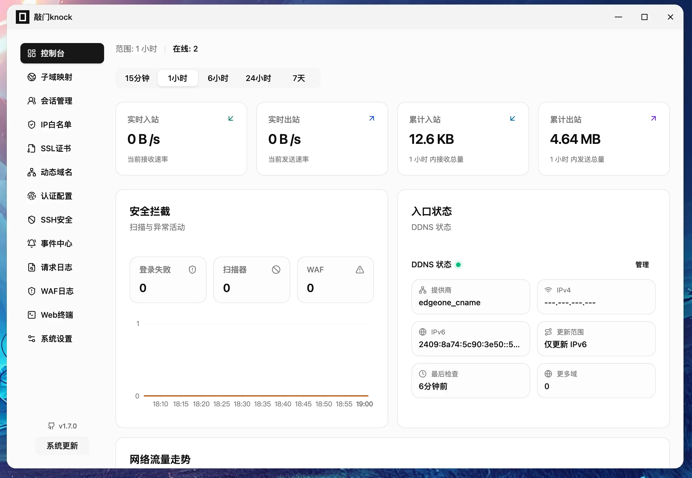
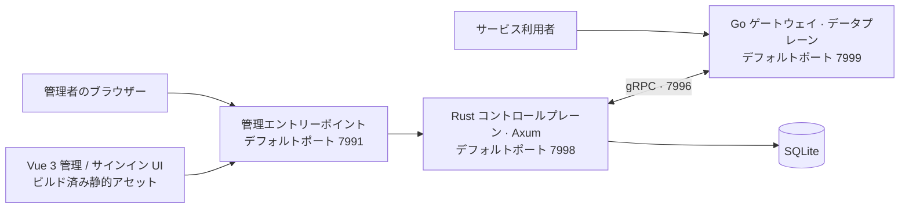

<p align="center">
  <a href="https://www.fnknock.cn/">
    
  </a>
</p>

<h1 align="center">fn-knock</h1>

<p align="center">
  <a href="../../README.md">简体中文</a> ·
  <a href="./README.en.md">English</a> ·
  <a href="./README.ko.md">한국어</a> ·
  <strong>日本語</strong>
</p>

<p align="center">
  NAS・OpenWrt ルーター・ホームサーバー向けの高性能マルチプラットフォーム・セキュリティゲートウェイ
</p>

<p align="center">
  <a href="https://www.fnknock.cn/"></a>
  
  
  
  <a href="https://hub.docker.com/r/kcilnk/fn-knock"></a>
  <a href="../../LICENSE"></a>
</p>

<p align="center">
  <a href="https://www.fnknock.cn/">公式サイト</a> ·
  <a href="https://docs.fnknock.cn/">ドキュメント</a> ·
  <a href="https://www.fnknock.cn/">ダウンロード</a> ·
  <a href="https://www.fnknock.cn/legal#terms">利用規約</a> ·
  <a href="https://www.fnknock.cn/legal#privacy">プライバシーポリシー</a>
</p>

fn-knock はネイティブアプリケーションとして全面的に再構築されました。本番ランタイムは **Rust のコントロールプレーン + Go のデータプレーン**で構成され、組み込みの SQLite ストレージを使用します。**実行時に Node.js も Redis も必要ありません。** Node.js は、ソースから Vue フロントエンドを開発し、モノレポのビルドタスクをオーケストレーションする場合にのみ使用します。

## fn-knock を選ぶ理由

fn-knock は、リバースプロキシ、アクセス認証、TLS 証明書、DDNS、アクセス制御、WAF、外部公開用トンネル、稼働状況を一つの管理画面に集約します。セルフホストしたサービスを、信頼できるユーザーへ安全かつ手軽に公開できます。

| 機能                       | 内容                                                                                                    |
| -------------------------- | ------------------------------------------------------------------------------------------------------- |
| セキュアゲートウェイ       | リバースプロキシ、Forward Auth（前段認証）、アクセスログ、Host / パスルーティング、TCP プロキシ         |
| ユーザー認証               | パスワード、TOTP、パスキー、OIDC、LDAP/Active Directory、認証コード、きめ細かな認証ポリシー             |
| ドメインと TLS             | ACME 証明書の発行、TLS 設定、複数の DNS プロバイダーに対応した DDNS                                     |
| プロアクティブ防御         | IP 許可リスト、地域別アクセス制御、WAF、ボット遮断、ログインバックオフ、レート制限                      |
| 外部公開用トンネル         | Cloudflare Tunnel（`cloudflared`）と frp クライアント（`frpc`）の設定、起動・停止、ログ、稼働状況の管理 |
| 日常運用                   | システム監視、監査イベント、Web ターミナル、通知、バックアップ、アップデート確認                        |
| マルチプラットフォーム配布 | fnOS、OpenWrt、Docker、Windows、macOS、Synology DSM、汎用 Linux                                         |

Web ターミナルは、管理者がホストフィンガープリントを明示的に信頼した SSH ターゲットを引き続きサポートします。完全版 FPK、汎用 Linux、macOS、OpenWrt ではローカル PTY も有効化できます。ローカル機能は既定で無効で、fn-knock サービスの実効 UID/GID（サービスが root の場合は root 権限）をそのまま継承します。FPK Lite、Synology、Docker、Windows、開発モードではローカルターミナルを提供しません。

> [!WARNING]
> 有効化前に、表示されるサービス実行ユーザー、Shell、初期ディレクトリを確認してください。権限降格、ユーザー切り替え、localhost SSH は行いません。ブラウザーを閉じてもプロセス内セッションは継続しますが、fn-knock の再起動で終了します。完全版 FPK のターミナル通信は `index.cgi` からループバックの Rust サービスへだけ転送し、fnOS 統一ゲートウェイ、Go/gRPC ルート、WebSocket は使用しません。

## アーキテクチャ



- **Rust コントロールプレーン：** 管理 API、認証、セキュリティポリシー、証明書、DDNS、トンネル、システム運用を担います。
- **Go データプレーン：** ゲートウェイのリスナー、リバースプロキシ、高スループットのサービストラフィックを処理します。
- **Vue 3 フロントエンド：** 静的アセットとしてビルドされ、インストールパッケージまたはコンテナイメージに同梱されます。Node.js ランタイムは不要です。
- **SQLite ストレージ：** 新規デプロイ時に Redis を別途運用する必要はありません。

## ダウンロードとインストール

まず [fn-knock 公式サイト](https://www.fnknock.cn/)でデバイスのプラットフォームとアーキテクチャを選択してください。お使いのシステムに適したパッケージまたはインストールコマンドと、最新のセットアップ手順を確認できます。

| プラットフォーム | OS / アーキテクチャ      | ダウンロードまたはインストール                                                                                                                                                      |
| ---------------- | ------------------------ | ----------------------------------------------------------------------------------------------------------------------------------------------------------------------------------- |
| fnOS             | x86_64                   | [FPK をダウンロード](https://get.fnknock.cn/)                                                                                                                                       |
| fnOS             | ARM64 / aarch64          | [FPK をダウンロード](https://get.fnknock.cn/?arch=arm64)                                                                                                                            |
| OpenWrt          | x86_64                   | [APK（25.12 以降）](https://get.fnknock.cn/?type=apk&arch=x86_64) · [IPK（24.10 / 旧バージョン）](https://get.fnknock.cn/?type=ipk&arch=x86_64)                                     |
| OpenWrt          | aarch64_cortex-a53       | [APK（25.12 以降）](https://get.fnknock.cn/?type=apk&arch=aarch64_cortex-a53) · [IPK（24.10 / 旧バージョン）](https://get.fnknock.cn/?type=ipk&arch=aarch64_cortex-a53)             |
| OpenWrt          | aarch64_generic          | [APK（25.12 以降）](https://get.fnknock.cn/?type=apk&arch=aarch64_generic) · [IPK（24.10 / 旧バージョン）](https://get.fnknock.cn/?type=ipk&arch=aarch64_generic)                   |
| OpenWrt          | arm_cortex-a7_neon-vfpv4 | [APK（25.12 以降）](https://get.fnknock.cn/?type=apk&arch=arm_cortex-a7_neon-vfpv4) · [IPK（24.10 / 旧バージョン）](https://get.fnknock.cn/?type=ipk&arch=arm_cortex-a7_neon-vfpv4) |
| OpenWrt          | arm_cortex-a5_vfpv4      | [APK（25.12 以降）](https://get.fnknock.cn/?type=apk&arch=arm_cortex-a5_vfpv4) · [IPK（24.10 / 旧バージョン）](https://get.fnknock.cn/?type=ipk&arch=arm_cortex-a5_vfpv4)           |
| Docker           | amd64 / arm64 / armv7    | [Docker Hub](https://hub.docker.com/r/kcilnk/fn-knock) · [デプロイ手順](../../deploy/docker/README.md)                                                                              |
| Windows          | Windows x86_64           | [EXE をダウンロード](https://get.fnknock.cn/?type=windows&arch=x86_64) · [インストール手順](https://www.fnknock.cn/windows)                                                         |
| Synology         | DSM 7.0+ x86_64          | [SPK をダウンロード](https://get.fnknock.cn/?type=synology&arch=x86_64) · [インストール手順](https://www.fnknock.cn/synology)                                                       |
| Linux            | x86_64 / ARM64 / ARMv7   | [ワンライナーインストール](https://www.fnknock.cn/linux) · [デプロイ手順](https://docs.fnknock.cn/quick-start/linux-deployment)                                                     |

### Docker

```bash
docker pull kcilnk/fn-knock:latest
```

本番環境では、[Docker Compose デプロイ手順](../../deploy/docker/README.md)に従ってポート、永続ボリューム、IPv6 サブネット、信頼するプロキシを設定してください。

### Linux

systemd と Alpine Linux で使われる OpenRC の両方に対応しています。公式のワンライナーインストールコマンドは次のとおりです。

```bash
wget -qO- https://cdn.fnknock.cn/install.sh | { if [ "$(id -u)" -eq 0 ]; then sh; else sudo sh; fi; }
```

インストール後、`http://<デバイス-IP>:7991` を開いて管理者パスワードを設定してください。外部向けゲートウェイリスナーのデフォルトポートは `7999` です。

> [!WARNING]
> 管理ポート `7991` をインターネットへ直接公開しないでください。リモート管理には VPN を使用するか、HTTPS とアクセス制御を設定した信頼できるリバースプロキシの背後に配置してください。

## デフォルトポート

| ポート | コンポーネント         | デフォルトの用途                                       |
| ------ | ---------------------- | ------------------------------------------------------ |
| `7991` | 管理エントリーポイント | ブラウザーから管理画面へアクセス                       |
| `7999` | Go ゲートウェイ        | プロキシ対象のサービストラフィックを受ける外部リスナー |
| `7998` | Rust バックエンド      | 内部管理 API                                           |
| `7997` | 認証サービス           | 内部サインイン UI サービス                             |
| `7996` | Go 管理 API            | Rust と Go 間の gRPC 通信                              |

実際のバインドアドレスはプラットフォームによって異なります。対象プラットフォームのインストール手順を参照してください。

## ソフトウェアサプライチェーンとプライバシー

すべての正式リリースに、検証可能なリリースメタデータが含まれます。

- マルチアーキテクチャ Docker イメージには、**SBOM** と最高レベルのビルド来歴（provenance）が付属します。
- GitHub Release に添付されるインストールパッケージには、ビルド証明、完全なアーティファクトマニフェスト、SHA-256 チェックサムが含まれます。
- [`release-manifest.json`](https://github.com/kci-lnk/fn-knock-turborepo/releases/latest/download/release-manifest.json) には、バージョン、ソースコミット、Go ゲートウェイのコミット、プラットフォーム、アーキテクチャ、ファイルサイズ、ダイジェストが記録されます。
- [`SHA256SUMS`](https://github.com/kci-lnk/fn-knock-turborepo/releases/latest/download/SHA256SUMS) を使って、GitHub Release からダウンロードしたファイルを検証できます。

インストールまたは使用する前に、次の文書を確認してください。

- [利用規約](https://www.fnknock.cn/legal#terms)
- [プライバシーポリシー](https://www.fnknock.cn/legal#privacy)
- [サードパーティー製オープンソースソフトウェアに関する表記](https://www.fnknock.cn/third-party-software)

fn-knock はセルフホストを前提に設計されています。公式プライバシーポリシーでは、プロジェクトの公式サイトおよび公式オンラインサービスが処理するデータと、自身のインスタンスに保存されるアカウント、ログ、セッション、プロキシ対象アプリケーションのデータを区別しています。自分のインスタンスを第三者に提供する場合は、実際の構成に応じたプライバシー通知を別途提示する責任があります。

## ソースから開発する

### 開発環境

| ツール                                | 用途                                                                                       |
| ------------------------------------- | ------------------------------------------------------------------------------------------ |
| Rust `1.96.0`                         | Rust コントロールプレーンとネイティブ Windows 管理アプリ                                   |
| Go                                    | `Go-Reauth-Proxy` ゲートウェイのビルド。必要なバージョンは同プロジェクトの `go.mod` を参照 |
| Node.js `^20.19.0` または `>=22.12.0` | Vue フロントエンドのビルド、テスト、Turborepo タスクのオーケストレーションにのみ使用       |
| npm `10.8.2`                          | ワークスペースのパッケージ管理                                                             |
| Docker / Buildx                       | マルチアーキテクチャイメージと一部のクロスプラットフォーム成果物のビルド                   |

```bash
npm ci
npm run dev
```

品質チェック：

```bash
npm run lint
npm run check-types
npm run test
npm run security:audit
```

すべてのワークスペースをビルド：

```bash
npm run build
```

デフォルトでは、隣接する `../Go-Reauth-Proxy` ディレクトリから Go ゲートウェイのソースを読み込みます。別のパスを使う場合は `FN_KNOCK_GO_REAUTH_PROXY_DIR` を設定してください。

## リポジトリ構成

| パス                      | 内容                                                              |
| ------------------------- | ----------------------------------------------------------------- |
| `apps/server-admin-rs`    | Rust / Axum 管理バックエンド、認証、コントロールプレーン          |
| `apps/server-admin-view`  | Vue 3 管理画面                                                    |
| `apps/server-auth-view`   | Vue 3 サインイン UI                                               |
| `apps/fn-knock-desktop`   | Rust + Win32 Windows 管理アプリと NSIS 設定                       |
| `apps/fn-knock`           | fnOS 向けネイティブ FPK 対応                                      |
| `apps/fn-knock-lite`      | fnOS の非 Root 環境向けネイティブ軽量版 FPK 対応                  |
| `apps/fn-knock-synology`  | Synology DSM 7 向けネイティブ SPK 対応                            |
| `deploy/docker`           | Dockerfile、Compose ファイル、イメージ公開設定                    |
| `deploy/linux`            | 汎用 Linux 向け systemd / OpenRC インストール・管理スクリプト     |
| `deploy/openwrt`          | OpenWrt APK / IPK パッケージングと LuCI 対応                      |
| `packages/grpc-contracts` | Rust コントロールプレーンと Go ゲートウェイ間の gRPC コントラクト |
| `packages/*`              | 共通フロントエンドコンポーネント、API、多言語リソース、ツール設定 |

## よく使うビルドコマンド

| コマンド                                       | 用途                                                  |
| ---------------------------------------------- | ----------------------------------------------------- |
| `npm run fn-knock:build-package`               | fnOS FPK をビルド                                     |
| `npm run fn-knock:lite:build-package`          | fnOS Lite FPK をビルド                                |
| `npm run fn-knock:linux:prepare`               | 汎用 Linux 向け成果物をビルド                         |
| `npm run fn-knock:openwrt:build`               | OpenWrt APK / IPK パッケージをビルド                  |
| `npm run fn-knock:spk:build`                   | Synology SPK をビルド                                 |
| `npm run fn-knock:docker:build`                | ローカル Docker イメージをビルド                      |
| `npm run fn-knock:windows:test`                | ネイティブ Windows ビルドのチェックを実行             |
| `npm run fn-knock:windows:build`               | Windows x86_64 向け未署名 NSIS インストーラーをビルド |
| `npm run fn-knock:release:test`                | リリースパイプライン全体を検証                        |
| `npm run fn-knock:release:preflight -- vX.Y.Z` | バージョンとリリース前提条件を検証                    |
| `npm run release status`                       | 現在のリリースバージョン状態を表示                    |

新しいリリースを準備するには、このリポジトリと隣接する `../Go-Reauth-Proxy` のワークツリーをクリーンにしてから、`npm run release prepare patch` を実行します（`minor`、`major`、または明示的な `X.Y.Z` も使用できます）。このツールは両方のリポジトリの製品バージョンを同期し、前回のバージョンタグ以降のコミットから release notes を生成します。Go リポジトリが別の場所にある場合は `FN_KNOCK_GO_REAUTH_PROXY_DIR` を設定してください。`--dry-run` で変更をプレビューでき、`--notes-file <path>` でリリースノートを指定できます。その後、`npm run release check` と `npm run fn-knock:release:test` を実行し、Go リポジトリを先に commit、push してください。このツールが commit、tag、push、publish を自動実行することはありません。

`version.json` と一致する `vX.Y.Z` タグを push すると、リリースワークフローが現在のソースと Go ゲートウェイのコミットを固定し、品質ゲートを実行して、すべての対応プラットフォームをビルドします。続いて対象アーキテクチャの検証、チェックサム、SBOM、ビルド来歴を生成し、GitHub Release を公開します。

## プロジェクトを支援

fn-knock が役に立ったら、作者にコーヒーをごちそうして継続的な開発とメンテナンスを応援してください。

<p align="center">
  
</p>

## ライセンス

[MIT](../../LICENSE)
