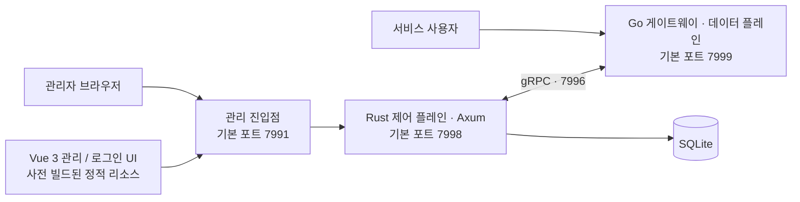

<p align="center">
  <a href="https://www.fnknock.cn/">
    
  </a>
</p>

<h1 align="center">fn-knock</h1>

<p align="center">
  <a href="../../README.md">简体中文</a> ·
  <a href="./README.en.md">English</a> ·
  <strong>한국어</strong> ·
  <a href="./README.ja.md">日本語</a>
</p>

<p align="center">
  NAS, OpenWrt 라우터, 홈 서버를 위한 고성능 멀티플랫폼 보안 게이트웨이
</p>

<p align="center">
  <a href="https://www.fnknock.cn/"></a>
  
  
  
  <a href="https://hub.docker.com/r/kcilnk/fn-knock"></a>
  <a href="../../LICENSE"></a>
</p>

<p align="center">
  <a href="https://www.fnknock.cn/">공식 웹사이트</a> ·
  <a href="https://docs.fnknock.cn/">사용 문서</a> ·
  <a href="https://www.fnknock.cn/">다운로드</a> ·
  <a href="https://www.fnknock.cn/legal#terms">이용약관</a> ·
  <a href="https://www.fnknock.cn/legal#privacy">개인정보 처리방침</a>
</p>

fn-knock은 네이티브 애플리케이션으로 전면 재구축되었습니다. 프로덕션 런타임은 **Rust 제어 플레인 + Go 데이터 플레인** 구조이며 내장 SQLite 스토리지를 사용합니다. **실행 시 Node.js도 Redis도 필요하지 않습니다.** Node.js는 소스에서 Vue 프런트엔드를 개발하고 모노레포 빌드 작업을 오케스트레이션할 때만 사용됩니다.

## fn-knock을 선택하는 이유

fn-knock은 리버스 프록시, 접근 인증, TLS 인증서, DDNS, 접근 제어, WAF, 외부 접속 터널, 서비스 상태를 하나의 관리 화면에 통합합니다. 셀프 호스팅 서비스를 신뢰할 수 있는 사용자에게 더 안전하고 간편하게 공개할 수 있습니다.

| 기능              | 설명                                                                                         |
| ----------------- | -------------------------------------------------------------------------------------------- |
| 보안 게이트웨이   | 리버스 프록시, 프록시 전단 인증, 접근 로그, Host / 경로 라우팅, TCP 프록시                   |
| 사용자 인증       | 비밀번호, TOTP, 패스키, OIDC, LDAP/Active Directory, 인증 코드, 세분화된 인증 정책           |
| 도메인과 TLS      | ACME 인증서 발급, TLS 설정, 여러 DNS 공급자를 지원하는 DDNS                                  |
| 선제적 보호       | IP 허용 목록, 지역 기반 접근 정책, WAF, 봇 차단, 로그인 백오프, 속도 제한                    |
| 외부 접속 터널    | Cloudflare Tunnel(`cloudflared`)과 frp 클라이언트(`frpc`)의 설정, 시작·중지, 로그, 상태 관리 |
| 일상 운영         | 시스템 모니터링, 감사 이벤트, 웹 터미널, 알림, 백업, 업데이트 확인                           |
| 멀티플랫폼 패키지 | fnOS, OpenWrt, Docker, Windows, Synology DSM, 범용 Linux                                     |

## 아키텍처



- **Rust 제어 플레인:** 관리 API, 인증, 보안 정책, 인증서, DDNS, 터널, 시스템 운영을 담당합니다.
- **Go 데이터 플레인:** 게이트웨이 리스너, 리버스 프록시, 대용량 서비스 트래픽을 처리합니다.
- **Vue 3 프런트엔드:** 정적 리소스로 빌드되어 설치 패키지나 컨테이너 이미지에 포함되므로 Node.js 런타임이 필요하지 않습니다.
- **SQLite 스토리지:** 새로 배포할 때 별도의 Redis 서비스를 운영할 필요가 없습니다.

## 다운로드 및 설치

먼저 [fn-knock 공식 웹사이트](https://www.fnknock.cn/)에서 장치 플랫폼과 아키텍처를 선택하세요. 현재 시스템에 맞는 설치 패키지나 명령어와 최신 설정 안내를 확인할 수 있습니다.

| 플랫폼   | OS / 아키텍처            | 다운로드 또는 설치                                                                                                                                                    |
| -------- | ------------------------ | --------------------------------------------------------------------------------------------------------------------------------------------------------------------- |
| fnOS     | x86_64                   | [FPK 다운로드](https://get.fnknock.cn/)                                                                                                                               |
| fnOS     | ARM64 / aarch64          | [FPK 다운로드](https://get.fnknock.cn/?arch=arm64)                                                                                                                    |
| OpenWrt  | x86_64                   | [APK(25.12+)](https://get.fnknock.cn/?type=apk&arch=x86_64) · [IPK(24.10 / 레거시)](https://get.fnknock.cn/?type=ipk&arch=x86_64)                                     |
| OpenWrt  | aarch64_cortex-a53       | [APK(25.12+)](https://get.fnknock.cn/?type=apk&arch=aarch64_cortex-a53) · [IPK(24.10 / 레거시)](https://get.fnknock.cn/?type=ipk&arch=aarch64_cortex-a53)             |
| OpenWrt  | aarch64_generic          | [APK(25.12+)](https://get.fnknock.cn/?type=apk&arch=aarch64_generic) · [IPK(24.10 / 레거시)](https://get.fnknock.cn/?type=ipk&arch=aarch64_generic)                   |
| OpenWrt  | arm_cortex-a7_neon-vfpv4 | [APK(25.12+)](https://get.fnknock.cn/?type=apk&arch=arm_cortex-a7_neon-vfpv4) · [IPK(24.10 / 레거시)](https://get.fnknock.cn/?type=ipk&arch=arm_cortex-a7_neon-vfpv4) |
| OpenWrt  | arm_cortex-a5_vfpv4      | [APK(25.12+)](https://get.fnknock.cn/?type=apk&arch=arm_cortex-a5_vfpv4) · [IPK(24.10 / 레거시)](https://get.fnknock.cn/?type=ipk&arch=arm_cortex-a5_vfpv4)           |
| Docker   | amd64 / arm64 / armv7    | [Docker Hub](https://hub.docker.com/r/kcilnk/fn-knock) · [배포 안내](../../deploy/docker/README.md)                                                                   |
| Windows  | Windows x86_64           | [EXE 다운로드](https://get.fnknock.cn/?type=windows&arch=x86_64) · [설치 안내](https://www.fnknock.cn/windows)                                                        |
| Synology | DSM 7.0+ x86_64          | [SPK 다운로드](https://get.fnknock.cn/?type=synology&arch=x86_64) · [설치 안내](https://www.fnknock.cn/synology)                                                      |
| Linux    | x86_64 / ARM64 / ARMv7   | [원라인 설치](https://www.fnknock.cn/linux) · [배포 문서](https://docs.fnknock.cn/quick-start/linux-deployment)                                                       |

### Docker

```bash
docker pull kcilnk/fn-knock:latest
```

프로덕션 환경에서는 [Docker Compose 배포 안내](../../deploy/docker/README.md)에 따라 포트, 영구 볼륨, IPv6 서브넷, 신뢰할 수 있는 프록시를 설정하세요.

### Linux

systemd와 Alpine Linux에서 사용하는 OpenRC를 모두 지원합니다. 공식 원라인 설치 명령어는 다음과 같습니다.

```bash
wget -qO- https://cdn.fnknock.cn/install.sh | { if [ "$(id -u)" -eq 0 ]; then sh; else sudo sh; fi; }
```

설치 후 `http://<장치-IP>:7991`에 접속해 관리자 비밀번호를 설정하세요. 외부 서비스용 게이트웨이 리스너의 기본 포트는 `7999`입니다.

> [!WARNING]
> 관리 포트 `7991`을 인터넷에 직접 노출하지 마세요. 원격 관리는 VPN을 사용하거나 HTTPS와 접근 제어가 적용된 신뢰할 수 있는 리버스 프록시 뒤에 배치하세요.

## 기본 포트

| 포트   | 컴포넌트      | 기본 용도                               |
| ------ | ------------- | --------------------------------------- |
| `7991` | 관리 진입점   | 브라우저에서 관리 화면에 접속           |
| `7999` | Go 게이트웨이 | 프록시 서비스 트래픽을 받는 외부 리스너 |
| `7998` | Rust 백엔드   | 내부 관리 API                           |
| `7997` | 인증 서비스   | 내부 로그인 UI 서비스                   |
| `7996` | Go 관리 API   | Rust와 Go 사이의 gRPC 통신              |

실제 바인드 주소는 플랫폼마다 다를 수 있습니다. 대상 플랫폼의 설치 안내를 확인하세요.

## 소프트웨어 공급망 및 개인정보 보호

모든 정식 릴리스에는 검증 가능한 릴리스 메타데이터가 포함됩니다.

- 멀티 아키텍처 Docker 이미지에는 **SBOM**과 최고 수준의 빌드 출처 증명(provenance)이 함께 게시됩니다.
- GitHub Release의 설치 패키지에는 빌드 증명, 전체 아티팩트 매니페스트, SHA-256 체크섬이 포함됩니다.
- [`release-manifest.json`](https://github.com/kci-lnk/fn-knock-turborepo/releases/latest/download/release-manifest.json)에는 버전, 소스 커밋, Go 게이트웨이 커밋, 플랫폼, 아키텍처, 파일 크기, 다이제스트가 기록됩니다.
- [`SHA256SUMS`](https://github.com/kci-lnk/fn-knock-turborepo/releases/latest/download/SHA256SUMS)로 GitHub Release에서 받은 파일을 검증할 수 있습니다.

설치하거나 사용하기 전에 다음 문서를 확인하세요.

- [이용약관](https://www.fnknock.cn/legal#terms)
- [개인정보 처리방침](https://www.fnknock.cn/legal#privacy)
- [서드파티 오픈 소스 소프트웨어 고지](https://www.fnknock.cn/third-party-software)

fn-knock은 셀프 호스팅을 중심으로 설계되었습니다. 공식 개인정보 처리방침은 프로젝트 웹사이트와 공식 온라인 서비스가 처리하는 데이터, 그리고 사용자의 자체 인스턴스에 저장되는 계정, 로그, 세션, 프록시 애플리케이션 데이터를 구분합니다. 다른 사람에게 자신의 인스턴스를 제공한다면 실제 설정에 맞는 별도의 개인정보 안내를 제공할 책임은 여전히 사용자에게 있습니다.

## 소스에서 개발하기

### 개발 환경

| 도구                                | 용도                                                                |
| ----------------------------------- | ------------------------------------------------------------------- |
| Rust `1.96.0`                       | Rust 제어 플레인과 네이티브 Windows 관리 프로그램                   |
| Go                                  | `Go-Reauth-Proxy` 게이트웨이 빌드. 필요한 버전은 해당 `go.mod` 참조 |
| Node.js `^20.19.0` 또는 `>=22.12.0` | Vue 프런트엔드 빌드, 테스트, Turborepo 작업 오케스트레이션에만 사용 |
| npm `10.8.2`                        | 워크스페이스 패키지 관리                                            |
| Docker / Buildx                     | 멀티 아키텍처 이미지와 일부 크로스 플랫폼 아티팩트 빌드             |

```bash
npm ci
npm run dev
```

품질 검사:

```bash
npm run lint
npm run check-types
npm run test
npm run security:audit
```

전체 워크스페이스 빌드:

```bash
npm run build
```

기본적으로 Go 게이트웨이 소스는 인접한 `../Go-Reauth-Proxy` 디렉터리에서 읽습니다. 다른 경로를 사용하려면 `FN_KNOCK_GO_REAUTH_PROXY_DIR`을 설정하세요.

## 저장소 구조

| 경로                      | 설명                                                    |
| ------------------------- | ------------------------------------------------------- |
| `apps/server-admin-rs`    | Rust / Axum 관리 백엔드, 인증, 제어 플레인              |
| `apps/server-admin-view`  | Vue 3 관리 화면                                         |
| `apps/server-auth-view`   | Vue 3 로그인 UI                                         |
| `apps/fn-knock-desktop`   | Rust + Win32 Windows 관리 프로그램과 NSIS 설정          |
| `apps/fn-knock`           | fnOS 네이티브 FPK 연동                                  |
| `apps/fn-knock-lite`      | fnOS 비 Root 환경용 네이티브 경량 FPK 연동              |
| `apps/fn-knock-synology`  | Synology DSM 7 네이티브 SPK 연동                        |
| `deploy/docker`           | Dockerfile, Compose 파일, 이미지 게시 설정              |
| `deploy/linux`            | 범용 Linux용 systemd / OpenRC 설치 및 관리 스크립트     |
| `deploy/openwrt`          | OpenWrt APK / IPK 패키징과 LuCI 연동                    |
| `packages/grpc-contracts` | Rust 제어 플레인과 Go 게이트웨이 사이의 gRPC 계약       |
| `packages/*`              | 공용 프런트엔드 컴포넌트, API, 다국어 리소스, 도구 설정 |

## 자주 사용하는 빌드 명령어

| 명령어                                         | 용도                                                   |
| ---------------------------------------------- | ------------------------------------------------------ |
| `npm run fn-knock:build-package`               | fnOS FPK 빌드                                          |
| `npm run fn-knock:lite:build-package`          | fnOS Lite FPK 빌드                                     |
| `npm run fn-knock:linux:prepare`               | 범용 Linux 아티팩트 빌드                               |
| `npm run fn-knock:openwrt:build`               | OpenWrt APK 및 IPK 패키지 빌드                         |
| `npm run fn-knock:spk:build`                   | Synology SPK 빌드                                      |
| `npm run fn-knock:docker:build`                | 로컬 Docker 이미지 빌드                                |
| `npm run fn-knock:windows:test`                | 네이티브 Windows 빌드 검사 실행                        |
| `npm run fn-knock:windows:build`               | Windows x86_64용 서명되지 않은 NSIS 설치 프로그램 빌드 |
| `npm run fn-knock:release:test`                | 전체 릴리스 파이프라인 검증                            |
| `npm run fn-knock:release:preflight -- vX.Y.Z` | 버전과 릴리스 전제 조건 검증                           |
| `bun run release status`                       | 현재 릴리스 버전 상태 확인                             |

새 릴리스를 준비하려면 이 저장소와 인접한 `../Go-Reauth-Proxy`의 워크트리를 모두 깨끗하게 한 다음 `bun run release prepare patch`를 실행합니다(`minor`, `major` 또는 명시적인 `X.Y.Z`도 사용할 수 있습니다). 이 도구는 두 저장소의 제품 버전을 동기화하고 이전 버전 태그 이후의 커밋에서 release notes를 생성합니다. Go 저장소가 다른 위치에 있으면 `FN_KNOCK_GO_REAUTH_PROXY_DIR`을 설정하십시오. `--dry-run`으로 변경 사항을 미리 보거나 `--notes-file <path>`로 릴리스 노트를 지정할 수 있습니다. 그런 다음 `bun run release check`와 `bun run fn-knock:release:test`를 실행하고 Go 저장소를 먼저 commit 및 push하십시오. 이 도구는 commit, tag, push 또는 publish를 자동으로 실행하지 않습니다.

`version.json`과 일치하는 `vX.Y.Z` 태그를 푸시하면 릴리스 워크플로가 현재 소스와 Go 게이트웨이 커밋을 고정하고, 품질 게이트를 실행하며, 모든 지원 플랫폼을 빌드합니다. 이어서 대상 아키텍처 검증, 체크섬, SBOM, 출처 증명을 생성하고 GitHub Release를 게시합니다.

## 프로젝트 후원

fn-knock이 유용했다면 커피 한 잔으로 지속적인 개발과 유지보수를 응원해 주세요.

<p align="center">
  
</p>

## 라이선스

[MIT](../../LICENSE)
